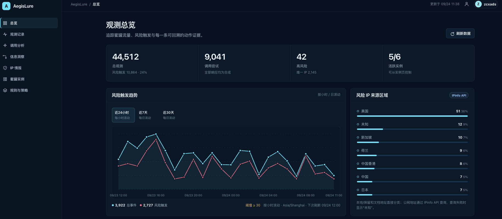

<p align="center"><strong>简体中文</strong> | <a href="README_EN.md">English</a></p>

<h1 align="center"></h1>

<p align="center"><strong>AI/LLM 服务蜜罐与 IP 风险情报平台</strong></p>

<p align="center">
  <a href="https://github.com/zcxads666/AegisLure/actions/workflows/ci.yml"></a>
  
  <a href="LICENSE"></a>
</p>

<p align="center">
  为 New API、vLLM、Ollama、SGLang、LocalAI 和 Sub2API 提供兼容式蜜罐入口，记录访问、认证、调用行为与风险事件。
</p>

<p align="center"><em>所有响应均为合成数据：不连接真实模型供应商、不执行真实推理，也不转发访问者提交的内容。</em></p>

<p align="center">
  <a href="#quick-start">快速开始</a> ·
  <a href="#admin-preview">管理后台预览</a> ·
  <a href="#network-ports">网络入口</a> ·
  <a href="#ip-list-api">IP 列表 API</a> ·
  <a href="docs/OPERATIONS.md">运维文档</a>
</p>

<h2 align="center" id="admin-preview">管理后台预览</h2>

<p align="center">
  
</p>

<p align="center"><sub>管理控制台总览：观测记录、风险趋势与 IP 来源区域。</sub></p>

<h2 align="center" id="core-capabilities">核心能力</h2>

- **多协议蜜罐：** 提供六类 AI/LLM 服务协议兼容入口与模型目录仿真。
- **完整管理界面：** 包含 New API 风格的用户页面，以及总览、观测记录、调用分析、交互链路、IP 情报、蜜罐实例和系统设置。
- **规则与身份策略：** 支持规则、正则条件、身份策略、OAuth 渠道和风险等级的查看与维护。
- **仿真登录入口：** 提供 GitHub、LinuxDO、Discord，以及 Sub2API 官方支持的 GitHub、LinuxDO、Google、WeChat、OIDC、DingTalk 入口；均为本地合成流程，可按身份策略启停。
- **IP 风险情报：** 本地及保留地址直接分类，公网地址通过 IPinfo API 查询，失败时回退为“未知”。
- **审计与导出：** 记录风险事件和审计信息，提供 IP/身份指标、JSON/CSV/plain/STIX2/nftables 导出与有界保留策略。
- **灵活部署：** 默认使用 SQLite，也支持 PostgreSQL；两种模式都会自动加载默认规则和模型目录。

<h2 align="center" id="quick-start">一键 Docker 部署</h2>

前置条件只有 Docker Engine（Linux）或 Docker Desktop（macOS），并启用 Docker Compose v2。支持 `linux/amd64`、`linux/arm64` 和 Apple Silicon；安装脚本还会检查 Docker daemon、Compose 和 OpenSSL 是否可用。

<p align="center"><strong>SQLite（默认，适合单机）</strong></p>

```bash
curl -fsSL https://raw.githubusercontent.com/zcxads666/AegisLure/main/install-remote.sh | bash -s -- --mode sqlite
```

<p align="center"><strong>内置 PostgreSQL（数据库不会暴露宿主机端口）</strong></p>

```bash
curl -fsSL https://raw.githubusercontent.com/zcxads666/AegisLure/main/install-remote.sh | bash -s -- --mode postgres
```

命令默认下载 GitHub `main` 源码并在本机 Docker 中构建，安装到当前目录的 `aegislure/`。如需指定目录或公网域名/IP：

```bash
curl -fsSL https://raw.githubusercontent.com/zcxads666/AegisLure/main/install-remote.sh | \
  bash -s -- --mode postgres --dir /opt/aegislure --public-host aegis.example.com
```

安装成功后，脚本会先确认容器健康和数据库连接正常，然后输出：

- 本机后台地址；
- 自动探测或通过 `--public-host` 指定的公网后台地址；
- 首次设置提示，管理员用户名默认预填为 `owner`，密码由用户在页面中自行设置（至少 8 个字符）；
- 管理端自签 TLS 证书的 SHA-256 指纹。

最终状态确认成功后，如果本次执行了本地镜像构建，安装器只会清理构建前不存在、且
由本次构建新增的 Docker builder 缓存记录；构建缓存快照无法读取时会跳过清理。安装
脚本不会删除预先存在的 `.tools` Go 缓存、镜像、容器、运行数据、数据库卷或其他项目
的 Docker 缓存。

首次打开后台时，浏览器会提示这是自签证书；核对命令输出的指纹后继续。创建 owner 后，恢复码只显示一次，请立即离线保存。安装器不会生成、保存或输出管理员密码。

使用固定 Release 镜像时，将 `--version main` 改为版本号或 `latest`：

```bash
curl -fsSL https://raw.githubusercontent.com/zcxads666/AegisLure/main/install-remote.sh | \
  bash -s -- --mode sqlite --version latest
```

`latest` 和固定版本会校验 Release 包 SHA-256，并使用 manifest 中的不可变 GHCR 镜像摘要。`main` 适合直接部署当前代码；生产环境发布后优先使用固定版本。

已克隆源码时也可直接安装：

```bash
./install.sh --mode sqlite
# 或
./install.sh --mode postgres --public-host 203.0.113.10
```

状态与健康检查：

```bash
cd aegislure
./hpctl status
./hpctl health
```

删除部署（会删除本地运行数据、恢复码、TLS 证书和内置 PostgreSQL 数据卷；外部 PostgreSQL 不受影响）：

```bash
INSTALL_DIR=/path/to/aegislure
(
  cd "$INSTALL_DIR"
  docker compose -f docker-compose.yml -f docker-compose.pg.yml --profile bundled-pg down --remove-orphans --volumes
)
rm -rf "$INSTALL_DIR"
```

<h2 align="center" id="network-ports">网络入口</h2>

Docker 默认启用五类公开 profile，并使用正常项目端口；LocalAI 与 Sub2API 互斥，默认启用 Sub2API：

| 服务 | 端口 |
| --- | ---: |
| New API | 3000 |
| vLLM | 8000 |
| Ollama | 11434 |
| SGLang | 30000 |
| LocalAI（可选） | 8081 |
| Sub2API | 8080 |

管理入口使用 `HP_ADMIN_PORT` 指定的高位端口，默认绑定到 `0.0.0.0`，以便从公网访问。公开蜜罐端口同样默认绑定到 `0.0.0.0`。可在 `.env` 中设置：

```env
HP_PROFILES=new-api,vllm,ollama,sglang,sub2api
HP_PUBLIC_PORT_BIND_IP=0.0.0.0
HP_ADMIN_PORT_BIND_IP=0.0.0.0
```

需要运行 LocalAI 时，将 `HP_PROFILES` 中的 `sub2api` 替换为 `localai`；同时选择两者时服务保留 Sub2API。

管理入口路径由服务随机生成，可通过 `./hpctl status` 查看。一键安装会直接打印包含该隐藏路径的完整地址。首次访问时创建 owner；页面默认填写用户名 `owner`，密码由部署者设置。请离线保存服务生成的恢复码，并通过防火墙、VPN 或可信反向代理限制管理端口来源。若只需要本机访问，可将 `HP_ADMIN_PORT_BIND_IP` 设置为 `127.0.0.1`。

在 VPS 上至少放行实际输出的 `HP_ADMIN_PORT`；公开蜜罐端口是否放行按用途决定。域名、云安全组、防火墙和 NAT 属于 Docker 主机之外的设施，安装器会输出地址但不会擅自修改它们。若自动探测的公网 IP 不适用，重新执行时传入 `--public-host`。

<h2 align="center" id="ip-list-api">IP 列表 API</h2>

管理后台可以把当前隐藏管理地址的 `/api` 路径开放为只读 IP 风险列表接口。接口默认关闭，开启后只返回本地已经聚合出的 IP 指标，不会访问真实模型或上游服务。

### 后台配置与 API key

登录管理后台后，进入“管理设置 → IP 列表接口”：

- 使用开关启用或停用接口。停用时请求返回 `404`。
- 页面会显示当前接口地址、请求方式和鉴权方式。
- 首次启用时自动生成 API key；也可以点击“轮换 key”生成新 key。旧 key 会立即失效。
- 完整 key 只在首次生成或轮换的响应中返回，页面刷新后只显示遮罩前缀；请在响应后立即保存。
- 服务只保存 key 的不可逆指纹，不保存完整 key。

- 开关和 key 轮换不是对外 API，只能在管理后台页面操作。服务端会要求变更请求带有与当前后台地址一致的浏览器 `Origin` 和页面令牌；直接复制命令、缺少页面令牌或跨站请求都会返回 `403`。

其中 `{ADMIN_BASE}` 是当前管理后台的完整地址，例如 `https://admin.example.com/<随机后台路径>`。

### 查询接口

```text
GET {ADMIN_BASE}/api
```

支持两种等价的鉴权写法，推荐使用 Bearer：

```bash
curl -fsS \
  -H 'Authorization: Bearer <API_KEY>' \
  '{ADMIN_BASE}/api'

# 或
curl -fsS \
  -H 'X-API-Key: <API_KEY>' \
  '{ADMIN_BASE}/api'
```

查询参数：

| 参数 | 类型 | 可选值 | 说明 |
| --- | --- | --- | --- |
| `days` | 整数 | `1`–`3650` | 查询最近 N 天；与 `month` 互斥 |
| `month` | 字符串 | `YYYY-MM` | 查询自然月，例如 `2026-09`；与 `days` 互斥，按 `Asia/Shanghai` 解析 |
| `risk_level` | 字符串 | `all`、`low`、`medium`、`high` | 风险筛选，默认 `all` |
| `risk` | 字符串 | `all`、`low`、`medium`、`high` | `risk_level` 的兼容短参数；同时传入时以 `risk_level` 为准 |

不带筛选参数时返回全量 IP。风险等级按指标分数划分：`low` 为 `0–29`，`medium` 为 `30–59`，`high` 为 `60` 及以上（当前风险分数范围为 `0–100`）。

示例：

```bash
# 全量 IP
curl -fsS -H 'Authorization: Bearer <API_KEY>' \
  '{ADMIN_BASE}/api'

# 最近 7 天的高风险 IP
curl -fsS -H 'Authorization: Bearer <API_KEY>' \
  '{ADMIN_BASE}/api?days=7&risk_level=high'

# 2026 年 9 月的中风险 IP
curl -fsS -H 'X-API-Key: <API_KEY>' \
  '{ADMIN_BASE}/api?month=2026-09&risk=medium'
```

`days` 和 `month` 不能同时使用；`days` 必须在 `1–3650` 范围内；`month` 必须是有效的 `YYYY-MM`。接口按来源 IP 限制为每分钟 60 次请求，并返回 `Retry-After: 60`。

### 响应格式

响应是 JSON，`items` 按 IP 聚合，每个 IP 返回一条指标：

```json
{
  "schema_version": 1,
  "success": true,
  "generated_at": "2026-09-22T08:00:00Z",
  "timezone": "Asia/Shanghai",
  "filters": {
    "days": 7,
    "risk": "high",
    "start_at": "2026-09-15T00:00:00Z",
    "end_at": "2026-09-22T00:00:00Z"
  },
  "count": 1,
  "items": [
    {
      "id": "indicator-id",
      "ip": "203.0.113.10",
      "score": 80,
      "risk_level": "high",
      "confidence": "high",
      "first_seen": "2026-09-20T12:00:00Z",
      "last_seen": "2026-09-22T07:30:00Z",
      "expires_at": "2026-10-22T07:30:00Z",
      "reason_codes": ["example_reason"],
      "products": ["new-api"],
      "sensor_count": 1,
      "site_count": 1,
      "recommended_action": "observe",
      "evidence_count": 3,
      "associated": false,
      "associated_ips": null,
      "association_reasons": null
    }
  ]
}
```

字段说明：`count` 是返回条数；`score` 是风险分数；`first_seen`、`last_seen` 和 `expires_at` 使用 RFC 3339 时间；`reason_codes` 是风险原因；`products` 是观测到该 IP 的服务类型；`evidence_count` 是证据数量；`associated`、`associated_ips` 和 `association_reasons` 表示 IP 关联关系。

常见错误：`401` 表示 key 缺失或无效，`404` 表示接口未启用，`400` 表示查询参数不合法，`429` 表示触发频率限制。

<h2 align="center" id="database-intelligence">数据库与 IP 情报</h2>

SQLite 是默认数据库。PostgreSQL 模式使用 `docker-compose.pg.yml`，内部数据库端口不会发布到宿主机；也可以通过 `HP_DATABASE_URL` 或 `HP_DATABASE_URL_FILE` 连接托管 PostgreSQL。

IP 情报仅使用 IPinfo API（City + ASN）查询公网地址；本地、保留和文档地址继续做确定性本地分类，不会发送给 IPinfo。管理设置中保存 key 时会先请求 `8.8.8.8` 验证，验证失败会提示并保留原配置；key 只由后端使用。key 更换后，下一次总览刷新会自动清除旧缓存并重新查询。

Docker Compose 的 `edge_net` 默认开启 masquerade，为 IPinfo API 查询提供出站 HTTPS；`bait_net` 和 `admin_net` 仍保持 internal。若主机防火墙限制出站，请至少允许 `ipinfo.io` 的 TCP 443。

备份只能恢复到相同数据库类型，SQLite 与 PostgreSQL 之间不执行隐式迁移。

<h2 align="center" id="security-data">安全与数据边界</h2>

- 所有模型响应、额度、密钥和账户数据均为虚拟数据。
- 不执行真实模型推理、工具调用、URL 访问、重定向、下载或上游转发。
- 上传内容仅进行有界分类、哈希或安全字段提取，不进入危险解析流程。
- 密码、Cookie、Authorization、验证码和 token 不以明文写入事件预览；新事件的完整受限原始请求只通过认证管理端展示，备份必须按敏感证据保护。
- 风险分用于表示观测证据，不等同于真实身份或自动封禁决定。

<h2 align="center" id="project-docs">项目文件</h2>

- [运维说明](docs/OPERATIONS.md)
- [架构说明](docs/ARCHITECTURE.md)
- [隐私与数据生命周期](docs/PRIVACY.md)
- [发布说明](docs/RELEASE.md)
- [安全策略](SECURITY.md)
- [第三方归属](NOTICE)

<h2 align="center" id="license">许可证</h2>

本项目使用 MIT License。使用、修改和分发本项目时请遵守 [许可证条款](LICENSE)。

<h2 align="center" id="friends">友情链接</h2>

<p align="center"><a href="https://linux.do/">Linux.Do — A new ideal community</a></p>
